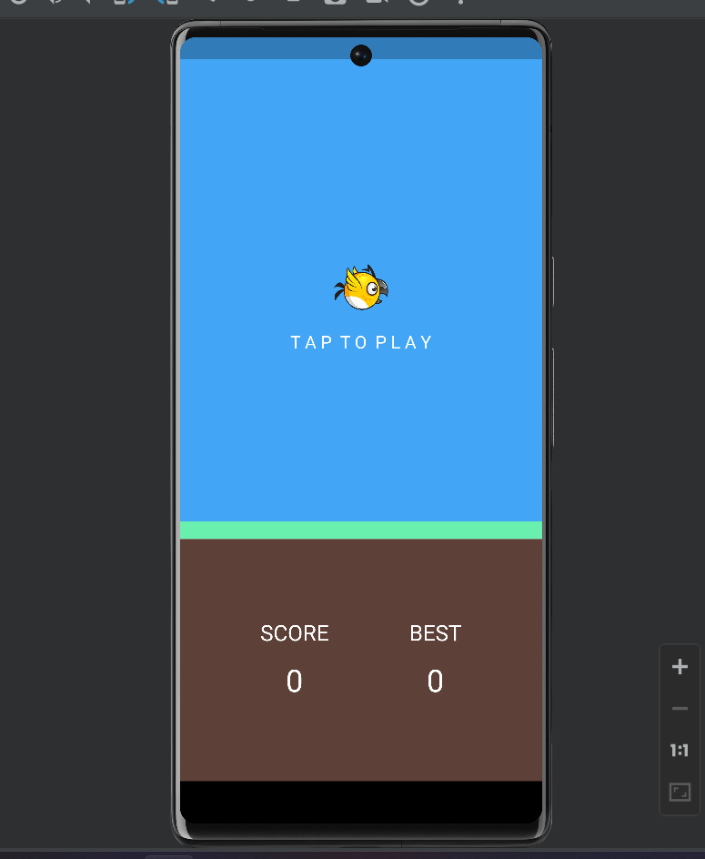
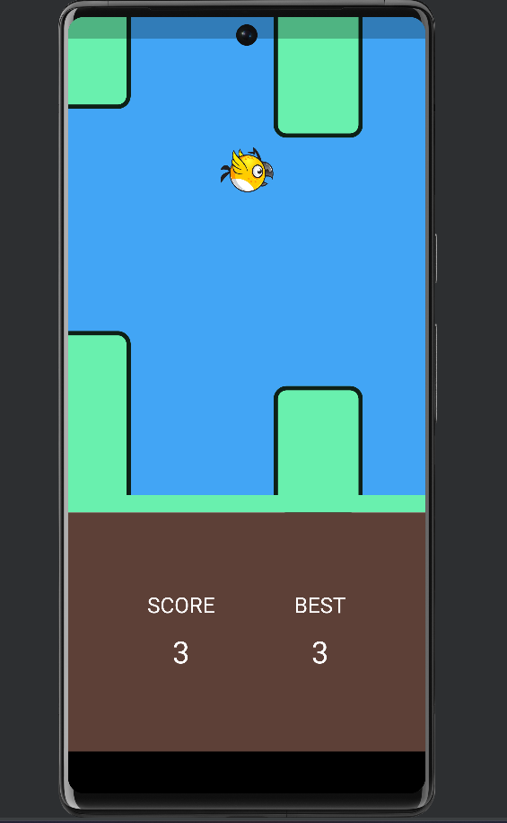
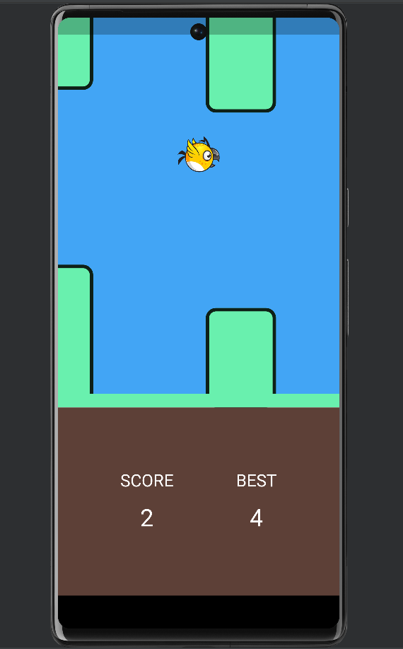
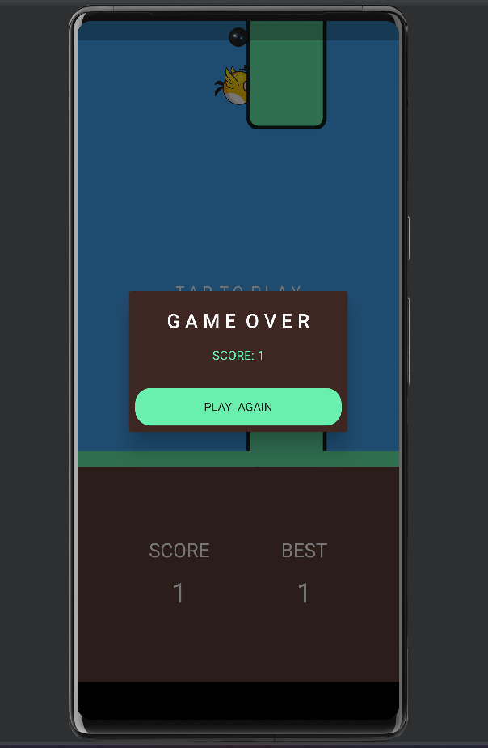
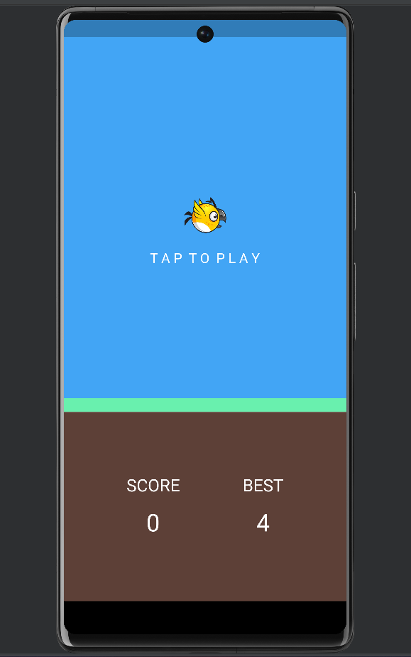

# Flappy Bird

Flappy Bird is a popular arcade-style game where the player controls a bird, attempting to fly between columns of green pipes without hitting them.

## Features
- Simple and addictive gameplay
- High score tracking
- Restart functionality
- Intuitive controls
  

## Gameplay Instructions
1. **Start the Game**: Click the start button or press the spacebar to begin.
2. **Control the Bird**: Tap the screen or press the spacebar to make the bird flap its wings and rise. Release to let the bird fall.
3. **Navigate Through Pipes**: Guide the bird through the gaps in the pipes to score points.
4. **Avoid Collision**: If the bird hits a pipe, the game ends and your score is displayed. You can restart the game from the game over screen.

## Screenshots

### Start Page

### Gameplay

### Game Over

### Start Page After Losing

## High Scores
- The game keeps track of your best score, which is displayed on the start page and game over screen.
  

## Getting Started

This project is a starting point for a Flutter application.

A few resources to get you started if this is your first Flutter project:

- [Lab: Write your first Flutter app](https://docs.flutter.dev/get-started/codelab)
- [Cookbook: Useful Flutter samples](https://docs.flutter.dev/cookbook)

For help getting started with Flutter development, view the
[online documentation](https://docs.flutter.dev/), which offers tutorials,
samples, guidance on mobile development, and a full API reference.
